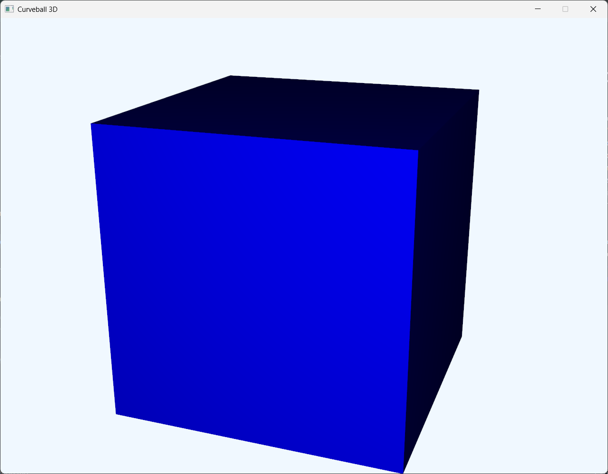

# Dev Log

## 11/28/2025 - Basic Class Structure and 3D Scene
### Decided on basic structure for project
This project will use JavaFX's built-in 3D features. The `GameWorld` 
class will encapsulate the 3D scene content including the tunnel, ball,
paddles, and camera. A `Subscene` is used to render this 3D world, in a
createGame method which is then added to the main `Scene` object of 
`A15_Diener_Parker_Application`. Of course this is subject to change 
by unforeseen complications.
### Created basic 3D scene
Scene displays a 3D blue box! Created method `testCube()` in `GameWorld` that
creates a blue box, then moves the camera so the box is in frame and
at an angle. Method is called in the constructor after camera is defined.

## 11/23/2025 - Proposal and Initial Project Setup
- Decided on Curveball3D for final project
- Wrote [Project Proposal](projectProposal.md)
- Created repository on [GitHub](https://github.com/parkerdiener/Curveball3D-JavaFinal) and linked project
- Set up basic project structure
- Created [README](README.md), [TODO](TODO.md), and devlog